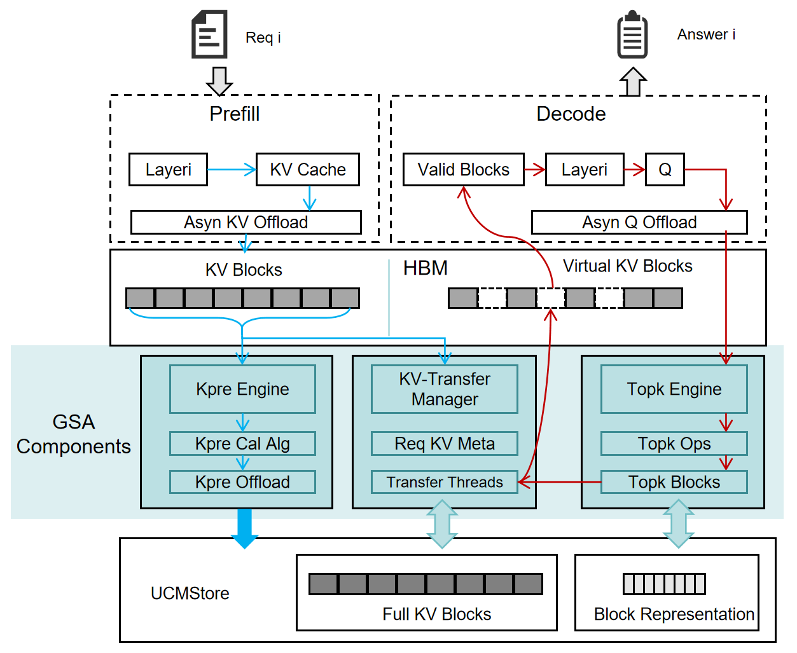
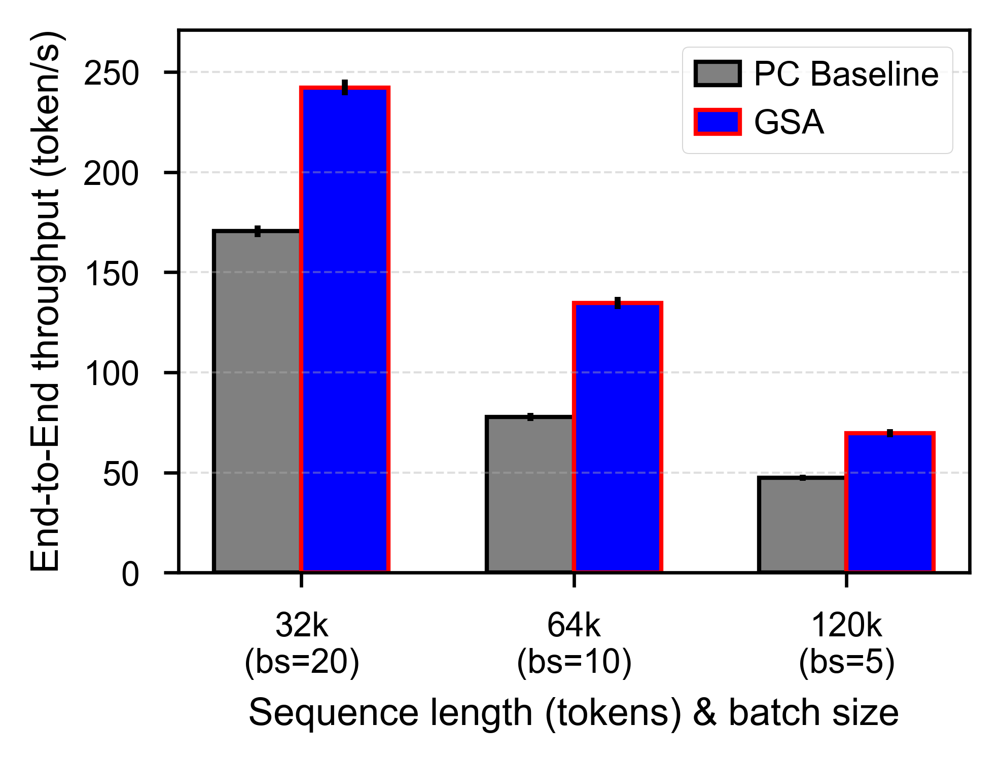
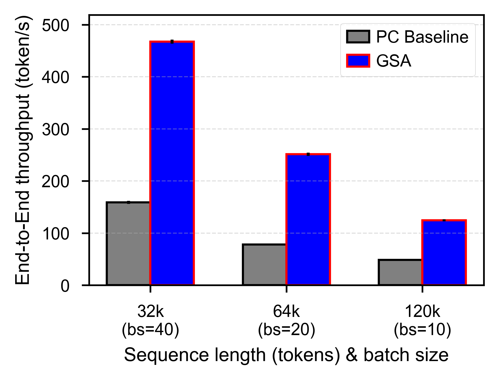

# 🌟 GSA: Geometric Sparse Attention for Efficient Inference of LLMs
<div align="center">

<!--  -->

    <!-- 宽度 400 像素 -->
 <br>
[](https://github.com/ModelEngine-Group/unified-cache-management/blob/main/LICENSE)
[](https://python.org)
</div>

## 🔍 Overview

GSA (Geometric Sparse Attention) simultaneously tackles the high computational complexity of long sequences and the concurrency limitations imposed by the HBM capacity wall. UCM GSA aims to develop a sparse framework compatible with mainstream inference engines, incorporating sparse representation algorithms, offloading and prefetching mechanisms, and collaborative XPU-CPU execution.


## 🎯 Key Innovations

- Representation-based Sparse Selection✅: To reduce the complexity of sparsity selection, we introduce a lightweight Sparsity Selector that pre-computes per-block representational scores during the Prefill phase and reuses them for zero-overhead top-k pruning in the Decode phase.


- Cross-hardware Support✅: To ensure cross-platform portability of GSA across heterogeneous accelerators (e.g., NVIDIA GPUs and Huawei Ascend NPUs), we introduce a Top-K offloading engine that asynchronously offloads attention queries (Q) to CPU memory for decoupled sparse selection computations.

- Efficient KV Transition⌛: We have designed a PrefetchEngine to orchestrate KV-cache offloading and prefetching, incorporating three key components: (1) sparse-block metadata management, (2) asynchronous prefetch worker threads, and (3) adaptive prefetch algorithms.

- Request-level Sparse Strategy（Not yet supported ❎）: We plan to design a sparse-policy module that, for every incoming request, perform a fast distribution estimation and then decides the optimal sparsification strategy.

- P+D Multi-stage Sparsity（Not yet supported ❎）: We plan to introduce layer-wise sparsification in the pre-fill stage to reduce TTFT for workloads with short decode lengths.


## 🔥 Key Results
In both performance and accuracy evaluations, we deployed the DeepSeek-R1-Distill-Qwen-32B model on two H20 GPUs.
## 🏆 Performance Highlights
### End-to-End Performance with 80 % Prefix-Cache Hit Ratio
Below are the end-to-end throughput results for inference scenarios without KVCache offloading. PC Baseline refers to the full attention method with an 80% prefix cache hit rate. The GSA method sparsifies each input request to 6K tokens, and in the experiments, each request generates 4K tokens of output.

<div align="center">

    <!-- 宽度 400 像素 -->


</div>

### End-to-End Performance with 80 % Prefix-Cache Hit Ratio (HBM-bound scenario)
Below are the end-to-end results of boosting inference concurrency through KV-Cache off-loading and prefetching under HBM-bound workloads; please note that this feature is not yet fully supported in the current open-source release, and we will make it available as soon as possible.

<div align="center">

    <!-- 宽度 400 像素 -->


</div>


## 📈 Accuracy Benchmarks
### Inference Accuracy with Various Tasks
As shown in the table below, we evaluated full attention and the GSA algorithm across multiple datasets for single-document QA, multi-document QA, and summarization tasks. The GSA method employs a mean-based block representation along with q-offloaded CPU top-k computation. In this experiment, we select requests longer than 4k from the datasets and set the sparsification ratio to 30%.


<table style="margin: auto; border-collapse: collapse; border-top: 2px solid black; border-bottom: 2px solid black;">
  <thead>
    <tr>
      <th style="border-bottom: 1px solid black; padding: 4px 10px;">Dataset</th>
      <th style="border-bottom: 1px solid black; padding: 4px 10px;">NarrativeQA</th>
      <th style="border-bottom: 1px solid black; padding: 4px 10px;">MFQA_ZH</th>
      <th style="border-bottom: 1px solid black; padding: 4px 10px;">HotpotQA</th>
      <th style="border-bottom: 1px solid black; padding: 4px 10px;">DuReader_ZH</th>
      <th style="border-bottom: 1px solid black; padding: 4px 10px;">GovReport</th>
      <th style="border-bottom: 1px solid black; padding: 4px 10px;">VCSUM_ZH</th>
      <th style="border-bottom: 1px solid black; padding: 4px 10px;">Average</th>
    </tr>
  </thead>
  <tbody>
    <tr><td style="padding: 4px 10px;">Full Attention</td><td style="padding: 4px 10px;">23.01</td><td style="padding: 4px 10px;">54.97</td><td style="padding: 4px 10px;">39.8</td><td style="padding: 4px 10px;">24.86</td><td style="padding: 4px 10px;">24.45</td><td style="padding: 4px 10px;">15.13</td><td style="padding: 4px 10px;">30.37</td></tr>
    <tr><td style="padding: 4px 10px;">GSA(Mean)</td><td style="padding: 4px 10px;">
     22.42</td><td style="padding: 4px 10px;">52.95</td><td style="padding: 4px 10px;">36.99</td><td style="padding: 4px 10px;">24.32</td><td style="padding: 4px 10px;">23.28</td><td style="padding: 4px 10px;">14.4</td><td style="padding: 4px 10px;">29.06</td></tr>
  </tbody>
</table>


## 🚦 Quick Start

### Basic Usage
Similar to UCM's `offline_inference_esa.py` examples. We only need to specify `ucm_sparse_method` to be `GSA` as shown below.


```python
...
ktc = KVTransferConfig(
    kv_connector=name,
    kv_connector_module_path="ucm.integration.vllm.uc_connector",
    kv_role="kv_both",
    kv_connector_extra_config={
        "ucm_connector_name": "UcmNfsStore",
        "ucm_connector_config": {
            "storage_backends": kv_store_path,
            "transferStreamNumber":16
        },
        "ucm_sparse_config": {
            "GSA": {}
        }
    }
)
...
```

Thus, an example command for launching the online LLM service is as follows:

```shell
vllm serve /home/models/DeepSeek-R1-Distill-Qwen-32B \
--served-model-name DeepSeek-R1-Distill-Qwen-32B \
--max-model-len 131000 \
--tensor-parallel-size 2 \
--gpu_memory_utilization 0.87 \
--trust-remote-code \
--port 8090 \
--block-size 128 \
--no-enable-prefix-caching \
--kv-transfer-config \
'{
    "kv_connector": name,
    "kv_connector_module_path": "ucm.integration.vllm.uc_connector",
    "kv_role": "kv_both",
    "kv_connector_extra_config": {
        "ucm_connector_name": "UcmNfsStore",
        "ucm_connector_config": {
            "storage_backends": kv_store_path,
            "transferStreamNumber":16
        },
        "ucm_sparse_config": {
            "GSA": {}
        }
    }
}'
```


## 📊 Supported Models

| Model | Size | Support |
|-------|------|-----------|
| Qwen3-14B | 14B | ✅ |
|DeepSeek-R1-Distill-Qwen-14B|14B|✅|
| Qwen3-32B | 32B | ✅ |
| QwQ-32B | 32B | ✅ |
|DeepSeek-R1-Distill-Qwen-32B|32B|✅|

## 🤝 Contributing
We welcome contributions! Please see our [Contributing Guide](../../developer-guide/contribute.md) for details.
