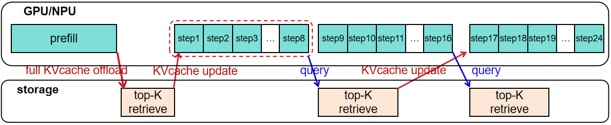
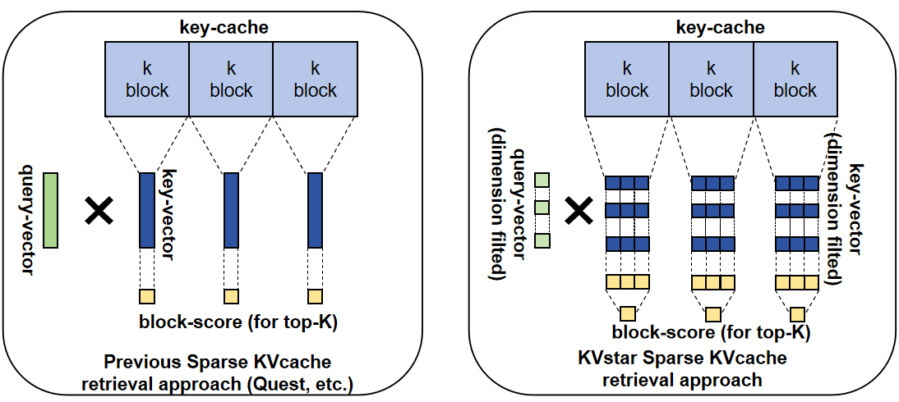

# KVstar: A KVcache Offloading Scheme for LLM decoding with High Retrieval Accuracy and Low Transfer Overhead

## 🎯 Key Design

KVstar is a sparse retrieval and offloading algorithm during the decode phase, integrated within the UCM. During decoding, KVstar offloads the entire KV cache to the storage side, retaining only a small part of KVcache (typically 25%) on the GPU/NPU. As attention shifts throughout the decode phase, KVstar continuously utilizes the CPU-side multi-core and SIMD computing power to retrieve important KV cache entries, asynchronously loads KVcache into GPU/NPU, and replaces the less important ones.

Key points included in KVstar:

- ✅ **Multi-step Coarse-grained Sparse Retrieval**: As shown in Figure 1, KVstar prefetches KVcache across multiple decode steps to achieves low-frequency, low-bandwidth interaction between the GPU/NPU and storage, reducing the synchronization overhead and bandwidth consumption of KVcache transfer.
- ✅ **Multi-query Retrieval Voting**: Uses multiple past query vectors from the current decode step for retrieval, mitigating the thrashing effect of traditional top-K retrieval to compensating for the inference accuracy loss caused by sparse attention.
- ✅ **Low-dimensional KV Cache Representation Retrieval**: As shown in Figure 2, the KV cache is stored and transferred at the block level, but the retrieval algorithm performs retrieval at the token granularity and votes to determine the importance of each KV cache block. To reduce retrieval computational overhead (preventing CPU computation from becoming a bottleneck), the channel dimensions of each attention heads are filtered and reduced based on importance.
- ⬜ **Incremental Transfer (coming soon)**: Leverages the redundancy between two consecutive transfers to avoid transmitting duplicate KV cache blocks, reducing bandwidth requirements.

|  |
| :-------------------------------------: |
|   Figure 1: KVstar Asynchronous Retrieval + Loading Diagram    |

|           |
| :------------------------------------------------: |
| Figure 2: KVstar Sparse Retrieval Approach (Right) |

For long-sequence inference, KVstar achieves the following with minimal accuracy loss:

- Saves HBM, increasing the batch size during the decode phase, thereby improving throughput under concurrent multi-request scenarios.
- Reduces the memory access volume for attention computation, thereby decreasing decode latency.


　

## 🚦 Quick Start

### Basic Usage
KVstar can be launched using the following command:
```shell
export MODEL_PATH="/path/to/model" # For example: /home/models/Qwen2.5-14B-Instruct
export DATASET_PATH="/path/to/longbench/multifieldqa_zh.jsonl" # For example: /home/data/Longbench/data/multifieldqa_zh.jsonl
export DATA_DIR="/path/to/data"
python examples/offline_inference_kvstar.py
```
KVstar can be configured by modifying `ucm_sparse_config` in `examples/offline_inference_kvstar.py`.
```python
...
ktc = KVTransferConfig(
    kv_connector=name,
    kv_connector_module_path=module_path,
    kv_role="kv_both",
    kv_connector_extra_config={
        "ucm_connector_name": "UcmNfsStore",
        "ucm_connector_config": {
            "storage_backends": "/path/to/data",
            "kv_block_size": 33554432,
        },
        "ucm_sparse_config": {
            "KVStarMultiStep": {
                "init_window_sz": 1,               # initial block count (do not participate in sparse)
                "local_window_sz": 2,              # local block count (do not participate in sparse)
                "sparse_ratio": 0.25,              # keep 25% blocks in GPU/NPU
                "retrieval_stride": 8,             # KVcache retrieval/update frequency (in decode steps)
                "blk_repre_dim_prune_ratio": 0.25, # 75% dimension filted, 25% dimension keeped for KVstar's retrieval
                "blk_repre_inner_token_merge": 2,  # retrieval unit
            }
        },
    },
)
...
```

　

## 🔥 Results
The following results were obtained using `Qwen2.5-14B-Instruct` under the hyperparameters in  `examples/offline_inference_kvstar.py`.

### 📈 Accuracy
We use [LongBench](https://huggingface.co/datasets/zai-org/LongBench) to evaluate the accuracy (F1-score) of the KVstar algorithm on H20 GPU. The model is `Qwen2.5-14B-Instruct` 

|  | Dataset | full Attention | KVstar (25% KVcache on GPU) |
|-------|-----------|-----------|-------|
| H20 GPU | dureader | 32.20 | 29.93 |
| Ascend 910B NPU | dureader | 32.46 | 31.08 |

### 🏆 Performance

(coming soon)
